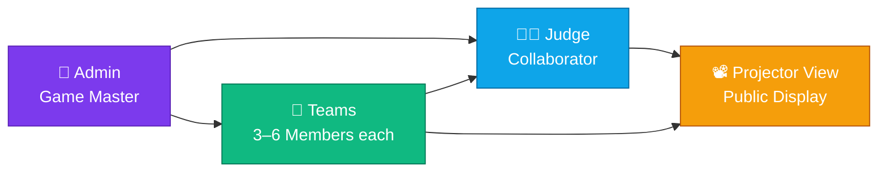
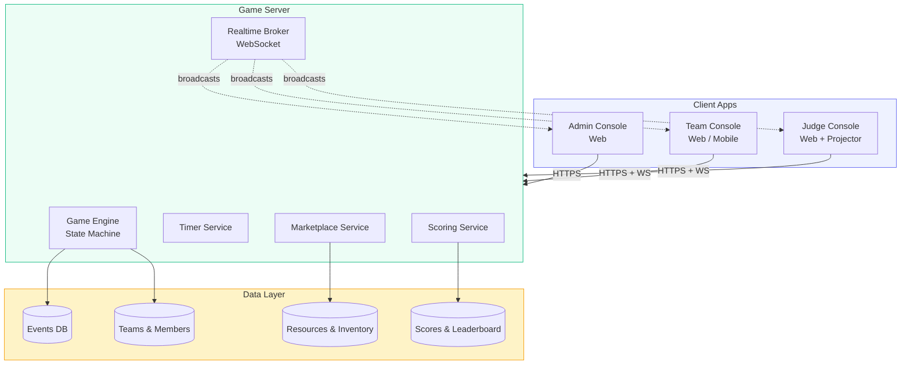
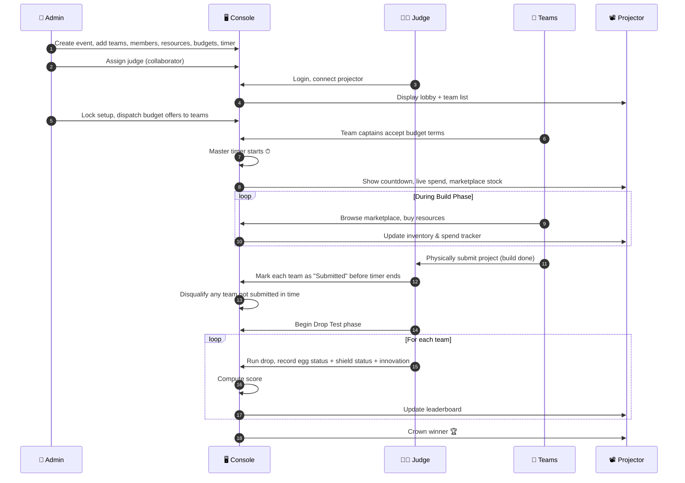
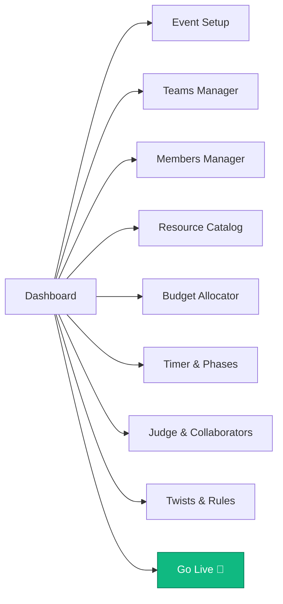
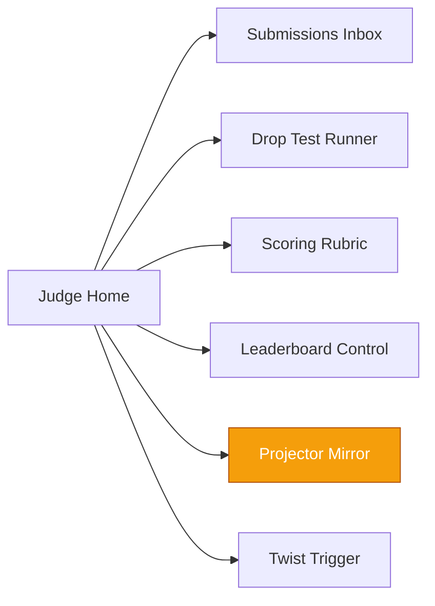
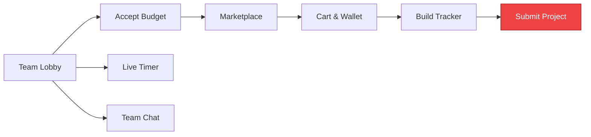
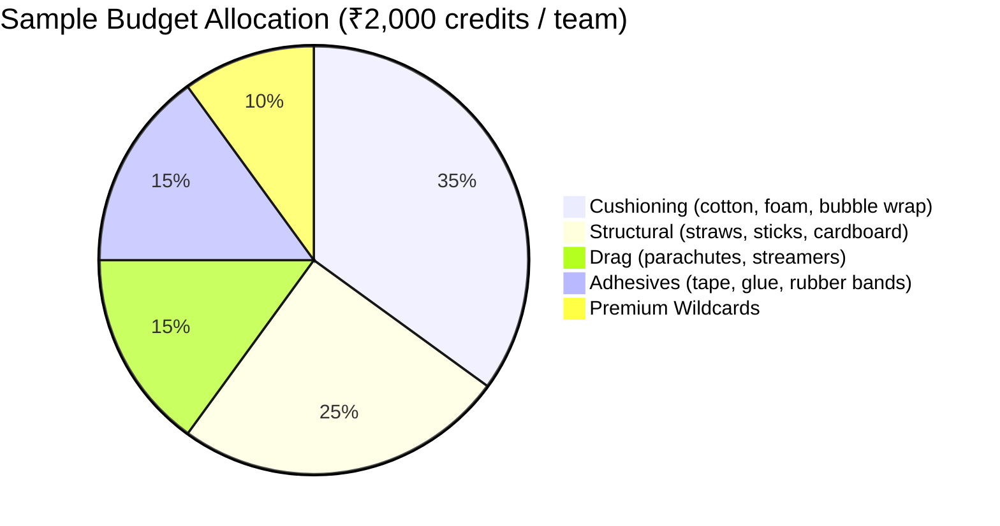
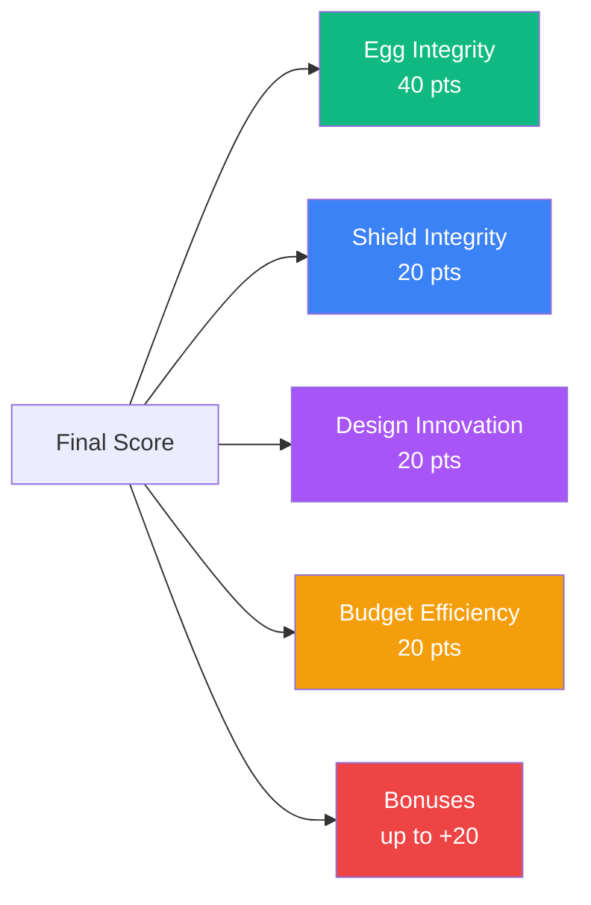
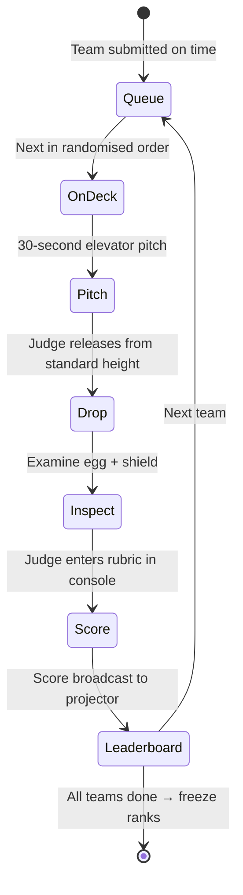
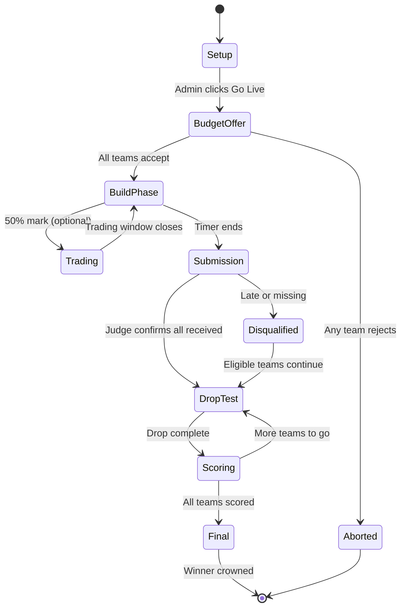

# 🥚 EGG DROP CONSOLE
### A Virtual Collaboration Platform for the Classic Corporate Team-Building Challenge

> A real-time, projector-friendly game console that runs the Egg Drop challenge end-to-end — from admin setup, to live marketplace, to judging and leaderboard — built for corporate L&D, offsites, and team-building events.

---

## Table of Contents
1. [Game in 60 Seconds](#1-game-in-60-seconds)
2. [Roles & Personas](#2-roles--personas)
3. [System Architecture](#3-system-architecture)
4. [End-to-End Game Flow](#4-end-to-end-game-flow)
5. [Console Modules (by role)](#5-console-modules-by-role)
6. [Refined & Enhanced Game Rules](#6-refined--enhanced-game-rules)
7. [The Resource Marketplace](#7-the-resource-marketplace)
8. [Scoring Framework](#8-scoring-framework)
9. [Drop Test Protocol](#9-drop-test-protocol)
10. [Leaderboard & Tie-Breakers](#10-leaderboard--tie-breakers)
11. [Penalties, Bonuses & Twists](#11-penalties-bonuses--twists)
12. [Game State Machine](#12-game-state-machine)
13. [Screen Wireframes (ASCII)](#13-screen-wireframes-ascii)
14. [Learning Outcomes](#14-learning-outcomes)
15. [Tech Notes](#15-tech-notes)

---

## 1. Game in 60 Seconds

```
   _______________      _______________      _______________
  |   SETUP       |    |   BUILD       |    |   DROP        |
  |   (Admin)     | -> |   (Teams)     | -> |   (Judge)     |
  |_______________|    |_______________|    |_______________|
  Create event,        Accept budget,        Live drop tests,
  teams, budget,       buy resources,        score each team,
  resources, judge.    build the shield,     leaderboard
                       submit before timer.  updates per drop.
```

Teams get a **budget** and a **timer**. They shop a marketplace, build a protective shield around a raw egg, and submit before time runs out. The Judge drops each contraption from a standard height and scores it. Highest score wins. The console handles all of this on one screen with a live projector view for the venue.

---

## 2. Roles & Personas



| Role | Who | What they do | Where they log in |
|---|---|---|---|
| **Admin** | L&D facilitator / event organiser | Configures the entire game: teams, budgets, resources, timer, judge | Web console (laptop) |
| **Judge** | Senior leader / external collaborator | Runs the live drop test, awards scores, controls the projector view | Web console + Projector |
| **Team Captain** | One per team | Accepts budget, finalises purchases, submits the project | Web console (laptop) |
| **Team Members** | 3–5 per team | Co-shop, co-build, see live spend & timer | Mobile / tablet |
| **Audience** | Non-playing colleagues | Watch the projector view | Read-only projector |

---

## 3. System Architecture



**Why this shape:** Every state change (a team purchases, a timer ticks, the judge awards a score) needs to fan out instantly to *all* connected clients — especially the projector. A WebSocket broker on top of a state machine keeps everyone in sync.

---

## 4. End-to-End Game Flow



---

## 5. Console Modules (by role)

### 5.1 Admin Console



| Module | What it does |
|---|---|
| **Event Setup** | Name, venue, date, drop height, max teams |
| **Teams Manager** | Create teams, assign colors, set captain |
| **Members Manager** | Add participants, assign to teams |
| **Resource Catalog** | Add items (name, price, stock, category, image) |
| **Budget Allocator** | Set credits per team (uniform or handicapped) |
| **Timer & Phases** | Define build duration, drop interval, warnings |
| **Judge & Collaborators** | Invite judge by email, generate projector link |
| **Twists & Rules** | Toggle optional rules (trading window, surprise twists, presentation bonus) |
| **Go Live** | Lock setup and dispatch budget offers |

---

### 5.2 Judge Console



- **Submissions Inbox** — Marks each team as "Received" as they hand in their build before the buzzer.
- **Drop Test Runner** — Calls the next team, opens the scoring rubric, records results.
- **Projector Mirror** — One-click "Cast to Venue Screen" — shows leaderboard + current team.
- **Twist Trigger** — Optionally fires a mid-game twist (extra height, sudden death, etc.).

---

### 5.3 Team Console



- **Marketplace** — Filter by category, see stock, add to cart.
- **Wallet** — Real-time remaining credits.
- **Build Tracker** — Optional checklist (e.g., "Shield wrapped", "Parachute attached") to keep the team focused.
- **Submit Project** — Final action; freezes the cart and notifies the judge.

---

## 6. Refined & Enhanced Game Rules

Your original ruleset is solid. Here is the **upgraded version** designed for a virtual collaborating application — with edge cases, fairness mechanics, and learning-outcome alignment baked in.

### 6.1 Pre-Game (Admin Setup)
- **R1.** Admin creates the event and locks venue + drop height (standard: 10 ft / 3 m).
- **R2.** Admin creates 2–8 teams. Each team has 3–6 members and one Captain (only the Captain can submit purchases and the final project).
- **R3.** Admin builds the **Resource Catalog**. Each resource has: `name`, `category`, `price (credits)`, `stock (limited)`, `bulk_discount` (optional).
- **R4.** Admin allocates **budget per team**. Default is uniform; handicap mode lets the admin give smaller teams more credits.
- **R5.** Admin sets the **Master Timer** (default 30 min build phase). Phase warnings fire at 50%, 25%, 10%, 1 min remaining.
- **R6.** Admin assigns one **Judge (Collaborator)** by email. The judge gets a separate console + a projector-cast link.

### 6.2 Game Start (Budget Acceptance)
- **R7.** When admin clicks **Go Live**, each Team Captain receives a "Budget Offer" notification.
- **R8.** Captains must **accept the budget within 2 minutes**. Non-acceptance = forfeit.
- **R9.** Master Timer begins the instant *all* teams have accepted (or the 2-minute window expires).

### 6.3 Build Phase
- **R10.** Teams buy from the marketplace. Stock is **first-come-first-served** — this creates real strategic tension.
- **R11.** **Refunds allowed** at 50% of price, but only in the first half of the build phase. After halfway, no refunds.
- **R12.** Teams cannot exceed their budget. The cart blocks over-budget purchases.
- **R13.** **Trading Window (optional, recommended):** A 5-minute window opens at the 50% mark where teams can trade resources peer-to-peer at any mutually agreed price.
- **R14.** Teams must hand the **physical build** to the Judge *and* click "Submit Project" before the timer hits zero.
- **R15.** **Disqualification triggers:**
  - Project not handed to judge before timer ends
  - Egg replaced (only the admin-issued egg is allowed)
  - Build uses resources not purchased from the marketplace
  - Build exceeds size limit (e.g., must fit in a 30 cm × 30 cm × 30 cm box)

### 6.4 Drop Test Phase
- **R16.** Judge calls teams in **randomised order** (the console randomises it — removes bias from "we went first").
- **R17.** Each team gets a **30-second pitch** before the drop. (Optional, awards Presentation points.)
- **R18.** The judge drops the contraption from the standardised height. **Drop must be vertical, no spin.**
- **R19.** Judge scores immediately on four dimensions (see §8).
- **R20.** A **slow-mo replay** is encouraged (phone camera, cast to projector). Adds drama; doesn't affect scoring.

### 6.5 Endgame
- **R21.** After all teams have dropped, the leaderboard freezes.
- **R22.** Ties resolved by tie-breaker hierarchy (see §10).
- **R23.** Top team wins. 2nd and 3rd recognised.
- **R24.** A **"Best Innovation"** and **"Most Frugal Build"** side award is given automatically based on data (highest Innovation score; lowest spend among top 50%).

---

## 7. The Resource Marketplace



A sample catalog the admin can clone and edit:

| Item | Category | Price (credits) | Stock |
|---|---|---|---|
| Cotton Ball (pack of 10) | Cushioning | 50 | 30 |
| Bubble Wrap (1 sq ft) | Cushioning | 80 | 20 |
| Foam Sheet (A4) | Cushioning | 100 | 15 |
| Drinking Straws (pack of 20) | Structural | 60 | 25 |
| Popsicle Sticks (pack of 10) | Structural | 70 | 25 |
| Corrugated Cardboard (A4) | Structural | 90 | 15 |
| Plastic Bag Parachute | Drag | 120 | 10 |
| Crepe Streamer (1m) | Drag | 40 | 30 |
| Masking Tape (1m) | Adhesive | 30 | 40 |
| Hot Glue (1 stick) | Adhesive | 70 | 15 |
| Rubber Bands (pack of 10) | Adhesive | 25 | 40 |
| 🎁 Mystery Box | Wildcard | 250 | 5 |
| 🪂 Mini Parachute Kit | Wildcard | 300 | 4 |
| 🏗️ Pre-Cut Frame | Wildcard | 350 | 3 |

> **Why stock limits matter:** Scarcity forces trade-offs and faster decision-making — the actual learning outcome of the game.

---

## 8. Scoring Framework

Each team's final score is out of **100 points** across four dimensions, plus bonuses.



### 8.1 Egg Integrity (40 pts) — *judged by inspection*
| Status | Points |
|---|---|
| Fully intact, no crack visible | 40 |
| Hairline crack, no leak | 25 |
| Visible crack, slight leak | 10 |
| Broken / smashed | 0 |

### 8.2 Shield Integrity (20 pts) — *did the build survive the drop?*
| Status | Points |
|---|---|
| Fully intact | 20 |
| Minor damage (one element loose) | 15 |
| Partial damage (structure dented) | 10 |
| Mostly destroyed | 5 |
| Completely destroyed | 0 |

### 8.3 Design Innovation (20 pts) — *judge's subjective rating*
Originality, elegance, use of unexpected materials. Judged on a 0–20 slider in the console.

### 8.4 Budget Efficiency (20 pts) — *auto-calculated*
```
efficiency_score = (1 − spent / budget) × 20
```
A team that uses 70% of its budget scores 6. A team that uses 30% scores 14. **Frugality is rewarded.**

### 8.5 Bonuses (+20 max)
| Bonus | Points |
|---|---|
| Submitted at < 75% of timer | +5 |
| Submitted at < 50% of timer | +10 |
| Pitch / Presentation (judge's rating) | up to +5 |
| Aesthetic Award (judge's pick) | +5 |

---

## 9. Drop Test Protocol



**Mechanical rules for the drop itself:**
1. Drop height is **constant** for all teams (set by admin pre-game).
2. The build must be **released, not thrown**. No spin, no toss.
3. The **landing surface is fixed** — a hard floor with a marked target square.
4. The build is **not opened by the judge until scoring is complete** — the audience experiences the suspense.
5. Each team gets **one drop only**. (Optional: "Sudden Death Round" for tied teams — see §11.)

---

## 10. Leaderboard & Tie-Breakers

The leaderboard updates live on the projector after every drop. Sample view:

```
╔══════════════════════════════════════════════════════════════╗
║  🏆 LIVE LEADERBOARD                          ⏱ 00:00 over   ║
╠══════════════════════════════════════════════════════════════╣
║  Rank   Team             Egg  Shield  Innov.  Budget   TOTAL ║
║  ────   ──────────────   ───  ──────  ──────  ──────   ───── ║
║   1     🟢 Team Eagles    40    20      18      14      92   ║
║   2     🔵 Team Phoenix   40    15      17      16      88   ║
║   3     🟡 Team Falcons   25    20      19      12      76   ║
║   4     🔴 Team Hawks      0    10      14      11      35   ║
╚══════════════════════════════════════════════════════════════╝
```

### Tie-Breaker Hierarchy
If two teams tie on total points, apply in order:
1. Higher **Egg Integrity** score
2. Higher **Budget Efficiency** score
3. Higher **Design Innovation** score
4. **Sudden-death drop** from increased height (judge's call)

---

## 11. Penalties, Bonuses & Twists

### Penalties
| Infraction | Penalty |
|---|---|
| Late submission (within 30s of buzzer) | −10 points |
| Late submission (> 30s) | Disqualification |
| Over-budget at submission | Disqualification |
| Using unauthorised material | Disqualification |
| Build exceeds size limit | −15 points |

### Optional Twists (Admin-Triggered)
The admin can enable any of these in the pre-game config — they keep the game fresh across repeat sessions:

| Twist | Effect |
|---|---|
| 🌀 **Sudden Wind** | At 50% timer, admin announces extra drag is needed — drop height increases by 50%. |
| 🎁 **Mystery Resource Drop** | A new high-value item appears in the marketplace at the 75% mark. |
| 💱 **Market Crash** | All resource prices reduce 30% for the last 10 minutes. |
| 🔁 **Forced Trade** | Each team must trade one item with another team at the 60% mark. |
| 🎯 **Bullseye Bonus** | A target square on the floor; landing inside it = +5 pts. |

---

## 12. Game State Machine



---

## 13. Screen Wireframes (ASCII)

### 13.1 Projector View (the venue's big screen)

```
┌─────────────────────────────────────────────────────────────────┐
│  🥚  EGG DROP CHALLENGE 2026     │  ⏱  BUILD PHASE  │ 12:34   │
├─────────────────────────────────────────────────────────────────┤
│                                                                 │
│   LIVE LEADERBOARD                MARKETPLACE ACTIVITY          │
│   ───────────────────────         ─────────────────────────     │
│   1.  🟢 Eagles     -- pts        🟢 Eagles bought Bubble Wrap  │
│   2.  🔵 Phoenix    -- pts        🔵 Phoenix bought Parachute   │
│   3.  🟡 Falcons    -- pts        🟡 Falcons traded with 🔴     │
│   4.  🔴 Hawks      -- pts        🔴 Hawks bought Foam Sheet    │
│                                                                 │
│   TEAM SPENT                      STOCK ALERTS                  │
│   ───────────────────────         ─────────────────────────     │
│   🟢 ₹1,200 / ₹2,000              ⚠ Mini Parachute: 1 left      │
│   🔵 ₹  900 / ₹2,000              ⚠ Foam Sheet: 2 left          │
│   🟡 ₹1,450 / ₹2,000                                            │
│   🔴 ₹1,800 / ₹2,000                                            │
│                                                                 │
└─────────────────────────────────────────────────────────────────┘
```

### 13.2 Admin Console (setup screen)

```
┌──────────────────────────────────────────────────────────────────┐
│  ADMIN · EGG DROP CONSOLE                              [ Go Live ]│
├──────────────┬───────────────────────────────────────────────────┤
│ Dashboard    │   EVENT SETUP                                     │
│ Event        │   ─────────────────────────────────────           │
│ Teams (4)    │   Name:    [ Q4 Offsite Egg Drop          ]       │
│ Members (18) │   Venue:   [ Bengaluru HQ Atrium          ]       │
│ Resources    │   Date:    [ 14 May 2026   ]   Time: [ 3:00 PM ]  │
│ Budgets      │   Drop Ht: [ 10 ft / 3 m   ]                      │
│ Timer        │                                                   │
│ Judge        │   TIMER                                           │
│ Twists       │   Build Phase:        [ 30 ] min                  │
│ Preview      │   Warnings:  ☑ 50%  ☑ 25%  ☑ 10%  ☑ 1 min        │
│              │                                                   │
│              │   JUDGE                                           │
│              │   Email:   [ judge@company.com    ] [ Invite ]    │
│              │   Projector Link: https://eggdrop.app/p/X9K2-     │
│              │                                                   │
└──────────────┴───────────────────────────────────────────────────┘
```

### 13.3 Team Console (marketplace)

```
┌──────────────────────────────────────────────────────────────────┐
│  🟢 TEAM EAGLES   ⏱ 12:34  ·  Wallet: ₹800 / ₹2,000              │
├──────────────────────────────────────────────────────────────────┤
│  Filter: [ All ▼ ]  [ Cushioning ] [ Structural ] [ Drag ]       │
│                                                                  │
│  ┌──────────────────┐  ┌──────────────────┐  ┌──────────────────┐│
│  │  Bubble Wrap     │  │  Foam Sheet      │  │  Mini Parachute  ││
│  │  ₹80   Stock: 18 │  │  ₹100  Stock: 2⚠ │  │  ₹300  Stock: 4  ││
│  │  [ Add to Cart ] │  │  [ Add to Cart ] │  │  [ Add to Cart ] ││
│  └──────────────────┘  └──────────────────┘  └──────────────────┘│
│                                                                  │
│  CART (3 items)                              [ Confirm Purchase ]│
│  · Bubble Wrap × 2      ₹160                                     │
│  · Straws × 1 pack      ₹ 60                                     │
│  · Hot Glue × 2 sticks  ₹140                                     │
│                                                                  │
│                          [ Submit Project ]  ← only when ready   │
└──────────────────────────────────────────────────────────────────┘
```

### 13.4 Judge Console (drop scoring)

```
┌──────────────────────────────────────────────────────────────────┐
│  🧑‍⚖️ JUDGE · DROP TEST                       Now scoring: 🟢 Eagles│
├──────────────────────────────────────────────────────────────────┤
│  STEP 1: Drop completed?   [ ✓ Released from 10 ft ]             │
│                                                                  │
│  STEP 2: Egg Integrity                                           │
│   ( ) Intact (40)   ( ) Hairline (25)                            │
│   (•) Crack (10)    ( ) Broken (0)                               │
│                                                                  │
│  STEP 3: Shield Integrity                                        │
│   (•) Intact (20)   ( ) Minor (15)                               │
│   ( ) Partial (10)  ( ) Destroyed (0)                            │
│                                                                  │
│  STEP 4: Design Innovation                                       │
│   [════════════════•═══] 18 / 20                                 │
│                                                                  │
│  STEP 5: Notes (optional)                                        │
│   [ Beautiful parachute integration, soft landing.       ]       │
│                                                                  │
│              [ Submit Score → Next Team ]                        │
└──────────────────────────────────────────────────────────────────┘
```

---

## 14. Learning Outcomes

The console is designed to surface and reward the same competencies Edstellar's ABL framework targets:

| Competency | How the game tests it |
|---|---|
| **Budget Management** | Real spend tracker, frugality bonus |
| **Time Management** | Master timer, early-submit bonus |
| **Strategic Decision-Making** | Limited stock, trading window, twists |
| **Cross-Functional Collaboration** | Captain/Treasurer/Engineer/Presenter roles |
| **Creative Problem-Solving** | Innovation score |
| **Performance Under Pressure** | Drop test pitch, public scoring |
| **Risk Assessment** | Wildcard / mystery items |

A post-game **debrief screen** auto-generates per-team analytics:
- Spend curve over time
- Decision points (when they bought what)
- Trades made
- Final score breakdown

This makes the activity defensible as **measurable L&D**, not just a fun offsite.

---

## 15. Tech Notes

A practical stack for building this:

| Layer | Suggestion |
|---|---|
| Frontend (all consoles) | Next.js + Tailwind + shadcn/ui |
| Realtime | Socket.io or Supabase Realtime |
| Database | Supabase (Postgres) — fits the self-hosted Coolify setup already running |
| Auth | Magic-link email (admin + judge); join-code (teams) |
| Projector mode | Read-only route `/p/:eventId` — TV-friendly typography, no controls |
| Mobile | Same Next.js app, responsive — teams use phones, admin/judge use laptops |

**Realtime events to broadcast:**
```
event:budget_accepted        event:purchase_made
event:trade_executed         event:stock_changed
event:timer_tick             event:project_submitted
event:team_disqualified      event:drop_completed
event:score_awarded          event:leaderboard_updated
event:twist_triggered        event:game_ended
```

---

## Appendix A: 1-Page Quick Reference Card

```
┌──────────────────────────────────────────────────────────┐
│   🥚 EGG DROP CHALLENGE · QUICK REFERENCE                │
├──────────────────────────────────────────────────────────┤
│  PHASES                                                  │
│  1. Setup (admin)            2. Budget Offer (2 min)     │
│  3. Build (30 min)           4. Submission (buzzer)      │
│  5. Drop Test (judge)        6. Leaderboard / Winner     │
│                                                          │
│  SCORING (100 + 20 bonus)                                │
│  Egg Integrity     40   Budget Efficiency   20           │
│  Shield Integrity  20   Bonuses           +20            │
│  Design Innovation 20                                    │
│                                                          │
│  KEY RULES                                               │
│  · Stock is first-come-first-served                      │
│  · No refunds after 50% of timer                         │
│  · Submit physically + digitally before buzzer           │
│  · Build must fit in 30×30×30 cm                         │
│  · One drop per team, one egg per team                   │
│                                                          │
│  WIN: highest total score on the leaderboard 🏆          │
└──────────────────────────────────────────────────────────┘
```

---

*Designed as a virtual collaboration application for corporate L&D facilitators. Pairs naturally with Edstellar's Activity Based Learning rulebook ecosystem.*
